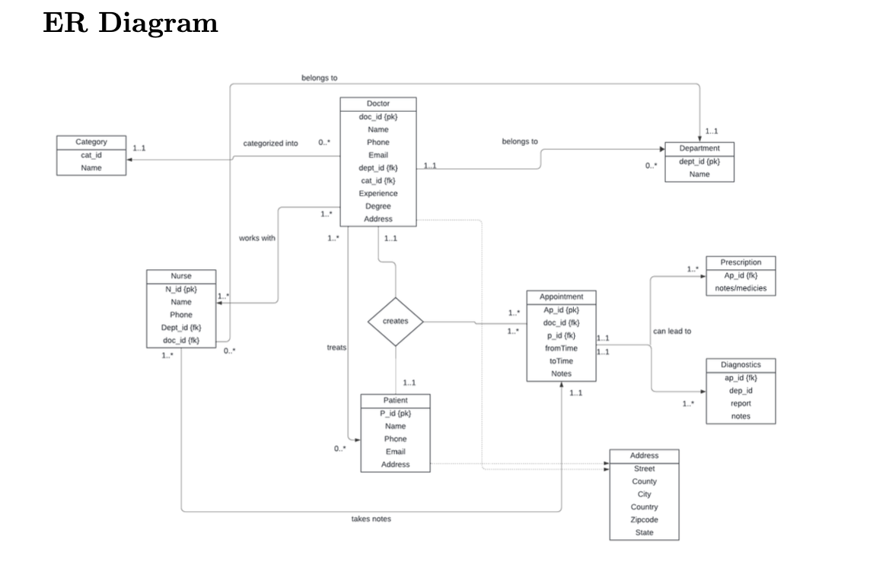

## Hospital Management System

### Objective/Scope:

We are developing a hospital management system to manage data of Doctors, Patients, Nurses and handling appointments.
This application can be used by Hospital staff to manage their data and appointments in an organized way

#### Main features are:
- User should be able add/update/delete/search a Doctor and their details
- User should be able add/update/delete/search a Patient and their details
- User should be able add/update/delete/search an Appointment and their details (No conflicting appointments)
- User should be able to add/update/delete/search Nurse as a Staff
- User should be able to add/Edit/delete a department

Along with managing above entities in our application, we will be ading an Analytics Dashboard for quick insights into the data.

#### Proposed analytics features are:
- Line Graph showing the number of patients daily/monthly/yearly
- Histogram showing the number of patients being handled by each department
- Histogram showing the number of patients being handled by each doctor

### Technical Details:
- Using flask to create web application and APIs along with HTML and Jinja files for frontend
- Using SQLAlchemy with SQLite db and models currently and managing SQL queries to accomplish the features in the application
- Using Dash and plotly to integrate figures into the analytics page of the application

#### Steps to start application:

- python3 -m venv venv

- source venv/bin/activate

- pip install -r requirements.txt

- To generate all installed libraries: pip freeze > requirements.txt
- python app.py

Doctors:
Name
Phone
Email
Department
Category - [Surgery, Medicine, Diagnostics]
Experience
Degree
Address

Patients:
Name
Phone
Email
Address

Appointments:
AppointmentId
DoctorId
PatientId
FromTime
ToTime
Notes

Department:
Name

Address:
Street
County
City
State
Country
Zipcode

Todo:

- ER Diagram - Sindhu
- age in patients - done
- complete department table with another page for its crud - done
- try replacing the sqlalchemy methods with SQL queries - done
- add validation in add/edit forms - Sindhu
- try adding one sample plotly figure in dash and then embed using iframe into homepage
- add code to install if not present for all libraries like flask, sqlalchemy - done
- Add Nurse, Diagnostics, Prescription model and UI
- Handle cascading delete of department, doctor and patient
- add multiple plotly figures utilising multiple kind of SQL queries
-> number of patients each day/month/year
-> patients vs department
-> doctors vs count of patients

Validations (Sindhu Krovvidi):
- Department 
    - User should enter only unique departments.
- Doctor
    - Valid Phone number (should be numeric)
    - Valid Email
    - Valid Experience (should be numeric) // TODO: add check for negative numeric in UI
    - Zip code (numeric)
    - Should have unique mail id
- Patient
    - Valid Phone number (should be numeric)
    - Valid Email // TODO: email should match <>@<>.<> pattern
    - TODO: When clicked on Edit then save without editing anything then email already exists checked which should be avoided
    - Zip code (numeric)
    - Should have unique mail id
- Appointments
    - To date is fixed to be upto 1hr from start date // TODO: make it 30 mins - Done
    - Check for doctors availability (To-do) - Done
    - TODO: When 12 am selected, end time automatically gets to 1 am, should be 1pm - Done

Feedback:
- Add validations on all the edit/delete
- Add user login - done
- Once login/user management works, add logging of who performed what action

Simplify presentation for a layman to understand
