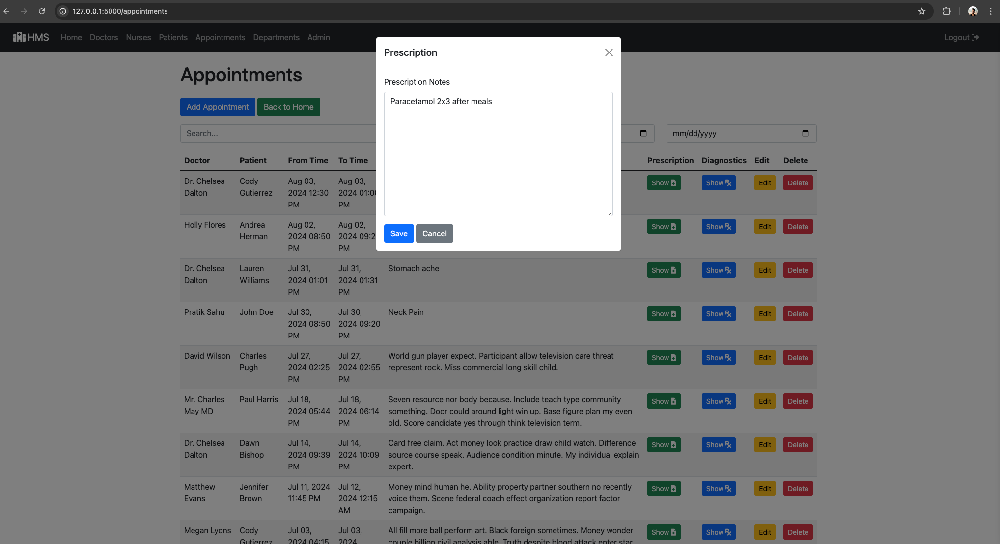
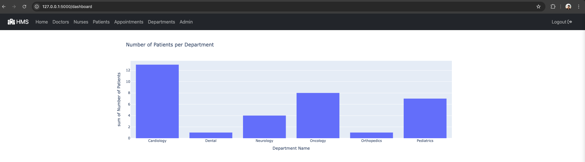
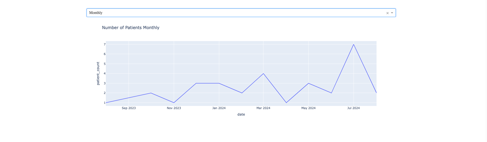

## Hospital Management System

### Objective:

We are developing a hospital management system to manage data of Doctors, Patients, Nurses and handling appointments.
This application can be used by Hospital staff to manage their data and appointments in an organized way.

### Goals:

- Streamline hospital data management
- Improve appointment handling
- Provide analytical insights

### Main features are:
- Application should have a homepage with options to login/signup       
- Users should be able to signup to use the application       
- Users should be able to login/logout in the application with signed up credentials          
- Admin User should be able to add/delete users as well as grant admin privileges       
- User should be able to add/Edit/delete a department       
- User should be able add/update/delete/search a Doctor and their details       
- User should be able to add/update/delete/search Nurse as a Staff and their details       
- User should be able add/update/delete/search a Patient and their details       
- User should be able add/update/delete/search an Appointment and their details (No conflicting appointments)          
- User should be able to add/edit/delete prescription and diagnostics following up from appointment          

#### Entity RelationShip Diagram

Along with managing above entities in our application, we will be ading an Analytics Dashboard for quick insights into the data.

#### Analytics features are:
- Interactive Histogram showing the number of patients being handled by each department       
- Interactive Histogram showing the number of patients being handled by each doctor        
- Interactive Histogram showing the patients with maximum number of diagnostics       
- Interactive Line Graph showing the number of patients daily/monthly/yearly       

#### Application Architecture

### Technical Details:

- Using flask to create web application and APIs along with HTML and Jinja files for frontend
- Using SQLAlchemy with SQLite db and models currently and managing SQL queries to accomplish the features in the application
- Using Dash and plotly to integrate figures into the analytics page of the application

#### Steps to start application:

- python3 -m venv venv

- source venv/bin/activate

- pip install -r requirements.txt (To generate all installed libraries: pip freeze > requirements.txt)

- python random_data.py (OPTIONAL: If want to generate random data)

- python app.py

#### Features checklist covered

· How many patients were registered each day? - Done

· How many patients were registered each month? - Done

· How many patients were registered each year? - Done

· How many patients were handled by each department? - Done

· How many patients were handled by each doctor? - Done

· What are the details of all the doctors in the system? - Done

· What are the upcoming appointments for the next week? - Done

· What are the details of all the nurses in the system? - Done

· Are there any conflicting appointments (appointments scheduled for the same doctor at the same time)? - Done

· How many diagnostics reports have been generated for each patient? - Done